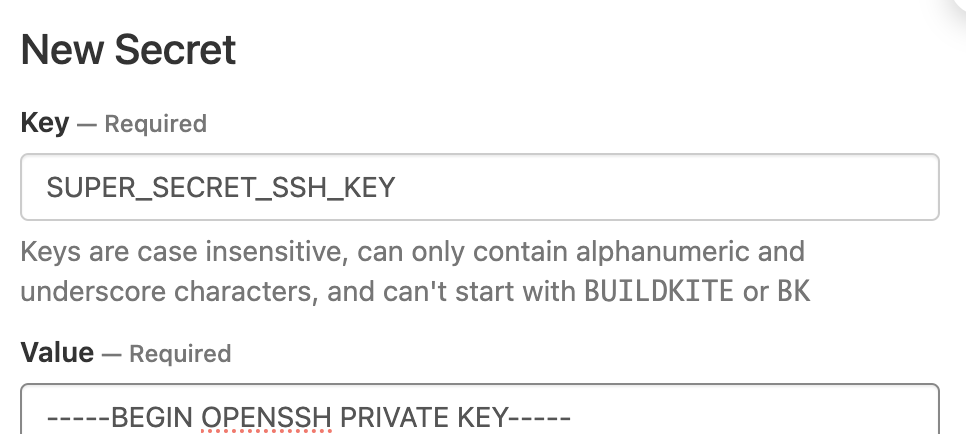

# Git SSH Checkout

A Buildkite plugin for arbitrary Git SSH checkout.

> [!NOTE]
> This plugin utilises the [buildkite-agent secret](https://buildkite.com/docs/agent/v3/cli-secret) functionality for storing the SSH key that will be used for checking out the Git repository.

## Options

### Optional

#### `repository-url` (string)

The full URL for referencing the repository. This is typically in the form of `git@{hostname}:{organisation}/{repository}.git`.

By default, the value for this will be the value of the `BUILDKITE_REPO` environment variable.

#### `ssh-secret-key-name` (string)

The name of the [secrets](https://buildkite.com/docs/agent/v3/cli-secret) key that contains the SSH key for interacting with the Git repository.

By default, the key name is `GIT_SSH_CHECKOUT_PLUGIN_SSH_KEY`.

#### `checkout-path` (string)

Replace the path the repository will be checked out to.

By default, the path will be `.`, the base path for the current build.

## Usage

The primary use-case for this plugin is within an environment where the pipeline repository configuration cannot be completely utilised, such as using a non-Github repository when working with hosted agents. This plugin can be used within the base steps for a pipeline to allow for the initial repository clone and further pipelines to be loaded.

When a pipeline is created, the core focus is around the repository that will contain the context that builds happen within, especially things like further pipelines. Consider the following screenshot.


Here a new pipeline is being created, without using one of the provided integrations. This means we can use any URL we'd like, though we aren't able to provide authentication details. Before we run a build, we can apply the use of this plugin to allow for our authentication to be injected, specifically an SSH key.

First we need to add a secret that contains the key. In the **Agents** page, select the **Cluster** that pipeline will run within, and click **Secrets** in the left-hand menu. Add a **New Secret** with a specific name for the key, and then paste the key content (this will be the private key, including the starting and opening text). The following screenshot shows what this should look like in the UI.



We've now added the `SUPER_SECRET_SSH_KEY` secret to our cluster. Back in our pipeline settings, we can modify the **Steps** to make use of this with the plugin. Our code would look something like the following.

```yaml
steps:
  - label: ":pipeline:"
    command: "buildkite-agent pipeline upload"
    plugins:
      - git-ssh-checkout#v0.0.1:
          ssh-secret-key-name: 'SUPER_SECRET_SSH_KEY'
```

The plugin will now replace the `checkout` functionality, and take the key from `SUPER_SECRET_SSH_KEY` and use it to authenticate for the `git clone`.

### Uploaded steps

Each step that works with the repository will need to include this plugin, as each time there's a checkout it needs to be replaced. This will mean copy-pasting the yaml each time. To lower the number of duplicated code lines, we can use [yaml anchors](https://www.educative.io/blog/advanced-yaml-syntax-cheatsheet#widget-parent-sKxMrCO3hs1xwmkqj7yLg%20__className_95156b%20__variable_95156b) to have yaml do the duplication for us.

Within a pipeline, we may then have some yaml like the following.

```yaml
steps:
  - label: ":hammer_and_pick: Run linter"
    command: "make lint"
    plugins: &base-plugins
      - git-ssh-checkout#v0.0.1: &checkout-plugin
          ssh-secret-key-name: 'SUPER_SECRET_SSH_KEY'

  - label: ":hammer_and_pick: Run tests"
    command: "make tests"
    plugins: *base-plugins

  - label: ":docker: Build image"
    command: "make build-image"
    plugins:
      - git-ssh-checkout#v0.0.1: *checkout-plugin
      - ecr#v2.9.0:
          login: true
```

Here we define the anchors in the first step, use the full list in the second, then in the third take the small anchor as we want to add more plugins to the list.

## Examples

Making use of the default values:

```yaml
steps:
  - label: "🔨 Running build"
    command: "echo Build happens here 💪"
    plugins:
      - git-ssh-checkout#v1.0.0:
```

### Overriding specific attributes

Specifying options that differ from the defaults:

```yaml
steps:
  - label: "🔨 Running build"
    command: "echo Build happens here 💪"
    plugins:
      - git-ssh-checkout#v1.0.0:
          repository-url: "git@example.com:org/repo.git"
          ssh-secret-key-name: "SUPER_SECRET_KEY"
```

### Using multiple repositories and keys

```yaml
steps:
  - label: "🔨 Running build A"
    command: "echo Build happening 🅰"
    plugins:
      - git-ssh-checkout#v1.0.0:
          repository-url: "git@example.com:org/repo-a.git"
          ssh-secret-key-name: "REPO_A_SECRET_KEY"
  - label: "🔨 Running build B"
    command: "echo Build happening 🅱"
    plugins:
      - git-ssh-checkout#v1.0.0:
          repository-url: "git@example.com:org/repo-b.git"
          ssh-secret-key-name: "REPO_B_SECRET_KEY"
```

## ⚒ Developing

You can use the [bk cli](https://github.com/buildkite/cli) to run the [pipeline](.buildkite/pipeline.yml) locally:

```bash
bk local run
```

## 👩‍💻 Contributing

1. Fork the repo.
2. Make the changes.
3. Run the tests.
4. Commit and push your changes.
5. Send a pull request.

## 📜 License

MIT (see [LICENSE](./LICENSE)).
